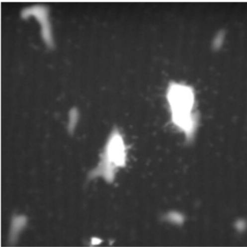
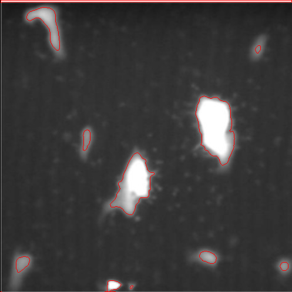
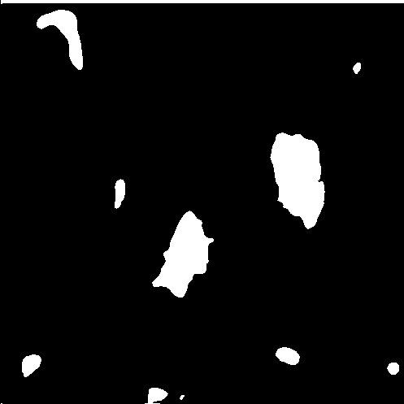

# cv2
A collection of commonly-used scripts for image processing.
### [auto-labelling](https://github.com/suzyi/cv2/tree/main/auto_labelling) for images with pure background in detection task.

  
  

### [`cv2.drawContours`](https://github.com/suzyi/cv2/tree/main/drawContours)

  
  
  

### read and save image
+ `cv2.drawContours(img, contours, contourIdx=-1, color=(0,0,255))`, `contourIdx=-1` indicates drawing all contours.
+ `cv2.fillPoly(img, pts=contours, color=(0,0,0))`, `img` is changed in an in-place way.
+ `img = cv2.imread("animal.png")`
  + `img_h, img_w, img_c = img.shape`
  + `img = [channel_blue, channel_green, channel_red]`
  + `value_max, value_min = img.max(), img.min()`, the pixel values are 0~255.
  + `data_type = img.dtype` is `numpy.uint8`.
  + `type(img)` is `<class 'numpy.ndarray'>`.
+ `cv2.imwrite("animal.png", img)`
  + `img` is of shape (img_h, img_w, img_c).
  + `img` is arranged in the order (b, g, r).
  + Pixel values are of data type numpy.uint8 and are at the interval 0~255.
+ `for cnt in contours: (center(x, y), (width, height), angle of rotation) = cv2.minAreaRect(cnt)`
+ `ret, img_binary = cv2.threshold(img_gray, thresh=110, maxval=255, type=1)`
  + inputs
    + `img_gray` is gray-scaled image of shape (h, w), dtype numpy.unit8 and pixel value 0~255. For example, `img_gray = img[:, :, 0]`.
    + `thresh` is a mannually specified threshold value.
    + `maxval`
    + `type=0` implies that pixel values greater than thresh are set to maxval, less than thresh are set to zero. `type=1` performs the opposite actions.
  + outputs
    + `ret` is the threshold that was used. The difference between ret and thresh is that ret doesn't work until type set to OTSU.
    + `img_binary` is the thresholded image.
+ `contours, hierarchy = cv2.findContours(img_binary, cv2.RETR_TREE,cv2.CHAIN_APPROX_SIMPLE)`
  + inputs
    + `img_binary` is of shape (h, w) with 255 denotes white points and 0 denotes black points. Remember, object to be found should be white and background should be black.
    + `cv2.RETR_TREE`
    + `cv2.CHAIN_APPROX_SIMPLE`
  + outputs
    + `contours` is a list of many cnt's, with each cnt is of type numpy.ndarray and shape (num_points, 1, 2).
    + `hierarchy`
